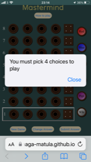
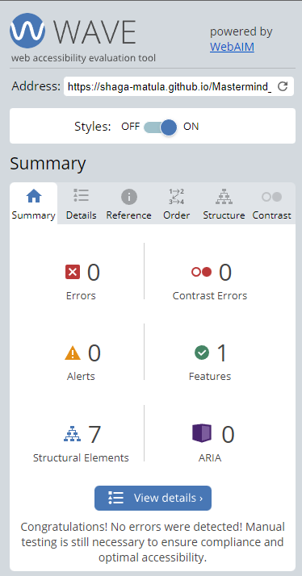

# MASTERMIND Game Paul Gleeson 5P PP2

# Introduction
Project portfolio 2 for Code Institute Full-stack development program: JavaScript Essentials.

Guess the color of hidden pegs. A deduction game where a player takes turn making a limited number of guesses, using logic to deduce what pegs the computer has hidden.

The Computer player secretly puts four colored pegs in the spaces behind a screen at a hidden place in the program. The player, the code breaker, makes a series of guesses. After each guess, the computer uses smaller pegs to tell the code breaker if their guessed pegs are the right color and in the right place, are the right color but the wrong place, or are the wrong color entirely. The code breaker makes another guess in the next row, building upon information from previous guesses, trying to match the pegs the computer hid at the beginning of the game.

[Live Project Here](https://shaga-matula.github.io/Mastermind_PG/index.html)

## README Table Content

* [Introduction](#introduction)
* [User Experience UX](#user-experience---UX)
* [Design](#Design)
    * [Wireframe](#Wireframe)
    * [Website Structure](#website-structure)
    * [Color Scheme](#color-scheme)
    * [Imagery](#Imagery)
    * [Typography](#typography)
    * [Interactive Links](#interactive-links) 
  
* [Features](#features)  
    * [Home Page](#home-page) 
    * [Navigation Menu](#navigation-menu)
    * [How To Play](#how-to-play)
* [Future Features](#future-features)
* [How to Play](#how-to-play)
* [Technologies Used](#technologies-used)
    * [Languages Used](#languages-used)
    * [Frameworks - Libraries - Programs Used](#frameworks---libraries---programs-used)
* [Testing](#testing)
* [Deployment](#deployment-this-project)
    * [Deployment This Project](#deployment-this-project)

* [Credits](#credits)
* [Content](#content)

## User Experience - UX

* As a web developer, I want to:
  
  1. Build an online quiz eye catching to the user’s at first sight so they are interested in playing the game.
  2. Make it easy to navigate the game and for users to play.
  3. Make it enjoyable and challenging for the player. 
   
* When a new player joins they should be able to:

  1. Read and understand the instructions easily.
  2. Navigate with simplicity.
  3. Get feedback from the game to enhance gameplay.
   
* Returning players:

  1. To be eager to beat their highest score.

## Design

### Balsamiq https://balsamiq.com/Wireframe
This is a mock-up of the intended build. Please note that some features may change during development as the project continues, but the image should be mostly accurate representation on the site.
 

<figure>
  
</figure>

### Website Structure
The game is written on one page, that splits into two sections and only one section will be visible at a time, Game section and instructions (How to Play) section. Both are available on large screens and small devices.

On small screens the orientation is disabled as the game is not supported on small landscape devices. When a user rotates the screen they will be presented with a clear visual explaining that this is not available and the user is instructed to rotate there device.

<figure>
  
</figure>

#### The Game:
* Homepage
* The page is presented to the user with a colorfull and user friendly display of the game. 
<figure>
  
</figure>

* How to play page 
* This page quickly guides the user through the criteria of playing the game.
<figure>
  
   <figcaption>How to Play</figcaption>
</figure>
 

* 404 Page 
  * A 404 page is implemented and will be displayed in case of a broken link.
  * The page will allow the user to navigate back to the main website, without the need of the back button.

<figure>
  
  <figcaption>404 Page</figcaption>
</figure>
<figure>
  
   <figcaption>404 Page Lighthouse</figcaption>
</figure>
<figure>
  
   <figcaption>404 Page HTML Check</figcaption>
</figure>

#### Color Scheme
 <figure>
  
</figure>
 The main color scheme that was chosen for this project to give a wooden feel (like the old game from the 80's) and is a mixture of brown tones and blue with a black background and white text for the instructions.

 #### Typography
* The two fonts were chosen for the site. Tilt Neon for the main title and Lucida Sans for white text on a black background. 

font-family: "Tilt Neon", sans-serif;
font-family: 'Lucida Sans', 'Lucida Sans Regular', 'Lucida Grande', 'Lucida Sans Unicode', Geneva, Verdana, sans-serif;

      
#### Imagery
* No Imagery was used on this site
  
### Interactive Links  
* Four buttons and six color choice icons are interactive for the user.  
    

* How to play button: Brings the user to the help file and hide all other contents.  

<figure>  

      <figcaption style="float: right; margin-right: 51%;">Right Panel Selector</figcaption>
     </figure>
  <figure>
     
     <figcaption>How To Play Btn:</figcaption>
  </figure>
 * New Game Button: Reloads the page and asked the user to chose a color, fill line and play. 
 * Change Answer Button: Increments backwards deleting a color at a time. 
 * Submit Answer Button: Enters the users choice and calculates the result. 
   <figure>
    
    <figcaption>New Game, Change Answer and Submit Btn:</figcaption>
  </figure>
  * Color Selection Area: A choice of six colors to make a guess from. 

    
    
## Features

### Home Page 

  <figure>
     
     <figcaption>Home Page</figcaption>
  </figure>

* Homepage Icon from Icon8
<figure>
  
</figure>

* When the user opens the Homepage they are presented with the full game website and they are instantly greeted and they have access to the game immediately. They are greeted and told that the computer has made a choice and ready to play 

<figure>
     
     <figcaption>Greeting</figcaption>
  </figure>

### Navigation Menu
  * The only navigation is to the "How to Play" file and back to the game page. 
  * When the user clicks the "How to Play" button: 
      * They are brought directly to the page and presented with the "How to Play" instructions.
      * They are then given the option to return to the game by clicking return to game.  
      
<figure>
     
     <figcaption></figcaption>
  </figure>
     
* Search engine keywords and description added to help the user find the page in search engines. 

  * content= "Games, Play Games, Mastermind game"
  * content= "Mastermind, board games, old school game"

### How to Play 

Guess the color of hidden pegs. A deduction game where a player takes turn making a limited number of guesses, using logic to deduce what pegs the computer has hidden.

The Computer player secretly puts four colored pegs in the spaces behind a screen at a hidden place in the program. The player, the code breaker, makes a series of guesses. After each guess, the computer uses smaller pegs to tell the code breaker if their guessed pegs are the right color and in the right place, are the right color but the wrong place, or are the wrong color entirely. The code breaker makes another guess in the next row, building upon information from previous guesses, trying to match the pegs the computer hid at the beginning of the game.

 
  * How to play Mastermind
       
  * First the user will click OK to close the "Computer is Ready to Play" alert.
  * The user then uses the right hand panel consisting of 6 colors by clicking any one of the colors. 
  * This will begin to populate the first row of the game.
  * The user can continue making choices or they can use the "Change Answer" button.
  
<figure>
     
     
     <figcaption>First Row</figcaption>
  </figure>
                          

<figure>
    
    <figcaption>Change Answer</figcaption>
  </figure>

  * The user must make four choices or: 
  * The computer will give an "Alert!" saying not enough colors chosen.
  * The computer will give an "Alert!" saying too many choices. 
<figure>
    
    
    <figcaption style="float: right; margin-right: 69%;">Not enough choice</figcaption>
    <figcaption>Too many choices</figcaption>
  </figure>
 
  * The user then clicks the "Submit" button and the computer will compare the two lines. 
  * The results are indicated by:
    * Computer displays a white peg for every color chosen that is in the correct place and the correct color.
    * Computer displays a black peg for every color chosen that is in not in the correct place but the color is present in the line.
    * Computer display a message that there are no correct colors in the row. 
    * The score "Black" and "White" pegs are <strong>randomly</strong> placed in the score area and <strong>do not</strong> correspond to position of choice.
<figure>
    
    <figcaption>Score results</figcaption>
  </figure>

  <figure>
    
    <figcaption>Interactive User Alerts</figcaption>
  </figure>

### Win
  * You win the game when you manage to guess <strong> all the colors in the code sequence and when
    they all in the right position.</strong>
### Lose 
  * You lose the game if you use all attempts without guessing the computer choice. The computer will then reveal answer.  
### Reset
  * The computer will then reset the game and start again.

# Future Development
  * Timer : Development a timer and display in game to give a sense of urgency in the game. 
  * Highest Score : Develop a highest score method to give the game a more completive edge using time and by line number to produce score.   
  * Sound : Develop a system where a beep can indicate choice, chime to win, meme to lose etc.  
  * Sound for visually impaired : Develop a clear voice choice "You have chosen red for first position line 1" etc..

### Languages Used 

* [HTML5](https://en.wikipedia.org/wiki/HTML5)
* [CSS3](https://en.wikipedia.org/wiki/Cascading_Style_Sheets)
* [javaScript](https://www.javascript.com/)

<figure>
    
    <figcaption>Languages</figcaption>
  </figure>

### Frameworks - Libraries - Programs Used

* [Google Fonts](https://fonts.google.com/)
   * Google fonts were used to import the 'Tilt Neon' font throughout the style.css.
* [Git](https://git-scm.com/)
    * Git was used for version control by utilizing the Gitpod terminal to commit to Git and Push to GitHub.
* [GitHub](https://github.com/)
    * GitHub is used to store the project's code after being pushed from Git.
* [VSCode](https://code.visualstudio.com/)
    * VSCode was used to create and edit the website.
* [Mobile Simulator](https://chrome.google.com/webstore/detail/mobile-simulator-responsi/ckejmhbmlajgoklhgbapkiccekfoccmk)
    * Mobile Simulater was used to test the website on a mobile device.
* [Balsamiq](https://balsamiq.com/wireframes/desktop/)
    * Wireframes were created using balsamiq from 

  
# Testing

The W3C Markup Validator and W3C CSS Validator Services were used to validate every page of the project to ensure there were no syntax errors in the project.

### [W3C Markup Validator](https://validator.w3.org)
* The HTML files were validated through the W3C Validator, presenting no errors.

### [W3C CSS Validator](https://jigsaw.w3.org/css-validator) 
* The CSS files were validated though the Jigsaw W3C Validator, presenting no errors.
#### Results:
* [Main CSS](https://jigsaw.w3.org/css-validator/validator?uri=https%3A%2F%2Fshaga-matula.github.io%2FMastermind_PG%2F&profile=css3svg&usermedium=all&warning=1&vextwarning=&lang=en)

* [Main Html](https://validator.w3.org/nu/?doc=https%3A%2F%2Fshaga-matula.github.io%2FMastermind_PG%2F)

<figure>
    
    <figcaption>CSS and HTML Results</figcaption>
  </figure>

### [Jshint](https://jshint.com/)
* All JavaScript files were validated through JSHint, presenting no errors.

<figure>
    
    <figcaption>JShint Results</figcaption>
  </figure>

# Hardware Testing
  * Chrome desktop and Alienware laptop used for windows testing. 
  * Mobile testing done on:

    * Ipad 6th gen
    * iPhone 5 
    * iPhone 6 
    * iPhone X 
    * iPhone 11 
    * iPhone 12  

# Virtual Testing
  * Virtual testing was done using the Google Chrome Browser and Chrome Developer used to check responsiveness on different screen sizes. 

## Steps to test:

* Open browser and navigate to Mastermind page. [Live Project Here](https://shaga-matula.github.io/Mastermind_PG/index.html)
* Open the developer tools (right click and then select inspect)
* First test set to responsive and decrease width to 320px
* Set the zoom to 50%
* Click and drag the responsive window to maximum width

* All screen sizes below were tested for responciveness.

  * Responsive on all device sizes between 320px - 2600px wide

    * BlackBerry Z30 (360px x 640px)  
    * BlackBerry PlayBook (600px x 1024px)  
    * Samsung Galaxy Note 3 (360px x 640px) 
    * Samsung Galaxy S3 (360px x 640px) 
    * Samsung Galaxy S8 (360px x 740px)   
    * Samsung Galaxy S9+(320px x 658px) 
    * Samsung Galaxy Tab S4(712px x 1138px) 
    * LG Optimus L70 (384px x 640px)
    * Microsoft Lumia 550 (640px x 360px) 
    * Microsoft Lumia 950 (360px x 640px) 
    * Motorola G4 (360px x 640px)
    * Nexus 4 (384px x 640px) 
    * Nokia Lumia 520 (320px x 533px) 
    * Nokia N9 (480px x 854px) 
    * Pixel 3 (393px x 786px)
    * Apple iPad Mini (468px x 4024)
    * Apple iPhone 4 (320px x 480px)
    * Apple iPhone 5/S (320px 568px)
    * Apple iPhone 6/7/8 (375px x 667px)
    * Apple iPhone 6/7/8 Plus (414px x 736px)
    * Apple iPhone X (375px x 812px)
  
### Lighthouse 

 Lighthouse was used to test Performance, Best Practices, Accessibility and SEO on both Desktop and Mobile devices. 

* Results:

<figure>
    
    
    <figcaption>Lighthouse Results</figcaption>
  </figure>

### Wave
  * Wave was used to test visuals and contrast and no issues were found.

<figure>
    
    
    <figcaption>Wave Results</figcaption>
  </figure>

## Test Functionality
* Hover over testing choices and buttons checked to ensure functionality.
* All pages load and refresh correctly on all device and all screen sizes.
* The game has been vigorously tested for logic and correct answers and is working correctly . 

### Manual Testing

## Testing Color Selection

<figure>
  
</figure>

* Color Selection Testing

| Test Item     | Method                           | Desired Result                                 | Result     | Pass |
| ------------- | -------------------------------- | ---------------------------------------------- | ---------- | ---- |
| Red Button    | Navigate to the Button and Click | The corresponding color will display in line 1 | As desired | Yes  |
| Green Button  | Navigate to the Button and Click | The corresponding color will display in line 1 | As desired | Yes  |
| Blue Button   | Navigate to the Button and Click | The corresponding color will display in line 1 | As desired | Yes  |
| White Button  | Navigate to the Button and Click | The corresponding color will display in line 1 | As desired | Yes  |
| Yellow Button | Navigate to the Button and Click | The corresponding color will display in line 1 | As desired | Yes  |
| Purple Button | Navigate to the Button and Click | The corresponding color will display in line 1 | As desired | Yes  |
|               |                                  |                                                |            |      |
|               |                                  |                                                |            |      |

* Button Testing

| Test Item           | Method                       | Desired Result                                                                    | Result     | Pass |
| ------------------- | ---------------------------- | --------------------------------------------------------------------------------- | ---------- | ---- |
| New Game Button     | Navigate to Button and Click | Screen Clear and Computer Message Ready to Play                                   | As Desired | Yes  |
| Change Answer       | Navigate to Button and Click | One color Choice Should Be Deleted from The Line                                 | As Desired | Yes  |
| Submit Button       | Navigate to Button and Click | Calculate Score or Display Message if Necessary, Display Score, Move to Next Line | As Desired | Yes  |
| How To Play Button  | Navigate to Button and Click | Display Game Rules File\\Hoe to Play                                              | As Desired | Yes  |
| Back to Game Button | Navigate to Button and Click | Display Game and Not Reload Page                                                  | As Desired | Yes  |

* Submit Button Testing

| Test Item           | Method                       | Desired Result                     | Result     | Pass |
| ------------------- | ---------------------------- | -----------------------------------| ---------- | ---- |
| One color          | Navigate to Button and Click | Populate Row                       | As Desired | Yes  |
| Two colors         | Navigate to Button and Click | Populate Row                       | As Desired | Yes  |
| Three colors       | Navigate to Button and Click | Populate Row                       | As Desired | Yes  |
| Four colors        | Navigate to Button and Click | Populate Row and Calculate Answer  | As Desired | Yes  |
| Try Add Color      | Navigate to Button and Click | Error Message                      | As Desired | Yes  |

* Score Testing Knowing The Answer (yellow, red, blue, green)

| Test Item                | Method                       | Desired Result                     | Result     | Pass |
| ------------------------ | ---------------------------- | -----------------------------------| ---------- | ---- |
| Row All Yellow           | Fill Row and Click Submit    | One White Peg                      | As Desired | Yes  |
| Row All Red              | Fill Row and Click Submit    | One White Peg                      | As Desired | Yes  |
| Row All White            | Fill Row and Click Submit    | Message "None"                     | As Desired | Yes  |
| Row All Blue             | Fill Row and Click Submit    | One White Peg                      | As Desired | Yes  |
| Row All Green            | Fill Row and Click Submit    | One White Peg                      | As Desired | Yes  |
| Row All Purple           | Fill Row and Click Submit    | Message "None"                     | As Desired | Yes  |
| Yellow, Red, Green, Blue | Fill Row and Click Submit    | Two White Peg, Two Black Pegs      | As Desired | Yes  |
| Yellow, Green, Red, Blue | Fill Row and Click Submit    | One White Peg, Three Black Pegs    | As Desired | Yes  |
| Blue, Red, Green, Yellow | Fill Row and Click Submit    | One White Peg, Three Black Pegs    | As Desired | Yes  |
| Purple, Green, Red, Blue | Fill Row and Click Submit    | One White Peg, Three Black Pegs    | As Desired | Yes  |
| Yellow, Red, Blue, Green | Fill Row and Click Submit    | WIN                                | As Desired | Yes  |
| Green, Red, Blue, Purple | Fill Row and Click Submit    | Two White Peg, One Black Pegs      | As Desired | Yes  |
| White, Red, Blue, Purple | Fill Row and Click Submit    | Two White Peg, One Black Pegs      | As Desired | Yes  |
| Green, Red, Blue, Purple | Fill Row and Click Submit    | Two White Peg, One Black Pegs      | As Desired | Yes  |
| Red, Red, Blue, Purple   | Fill Row and Click Submit    | Two White Peg                      | As Desired | Yes  |

* Win Lose Testing Knowing The Answer (yellow, red, blue, green)

| Test Item                      | Method                       | Desired Result                     | Result     | Pass |
| -----------------------------  | ---------------------------- | -----------------------------------| ---------- | ---- |
| yellow, red, blue, green       | Fill Row and Click Submit    | Win Message Displayed              | As Desired | Yes  |
| Row 8 yellow, red, blue, blue  | Fill Row and Click Submit    | Lose Message Displayed and Reset   | As Desired | Yes  |

* Help File Testing

| Test Item                      | Method                         | Desired Result                      | Result     | Pass |
| ------------------------------ | ----------------------------   | ----------------------------------- | ---------- | ---- |
| Open How to Play Button        | Navigate and Click How To Play | Help\Instruction File Displayed     | As Desired | Yes  |
| Return to Game                 | Navigate and Click Back to Game| Returns to game and does not Reload | As Desired | Yes  |

# Bugs 

 * Game not compatible with Landscape Orientation.
<figure>
  
</figure>

### Fixed Bug
* Add media queries for landscape to avoid this issue happening. 
* Used CSS to blank off screen and alert the user with friendly message that the orientation is not supported. 

<figure>

</figure>

* On small screen and returning to game after reading the instructions, scroll gap at bottom of page.  

<figure>
  
</figure>

### Fixed Bug
  * Added "window.scrollTo(0, 0);" to the "Return to Game" button in JavaScript. This will scroll the game page to top and the look will make the reveal more uniform. 

## Version Control
    
  * Visual Studio code editor was used to create the site and pushed to github to the remote repository ‘Mastermind’.
  * The git commands line codes below were used throughout development to push code to the remote repo:
  * git add <file> - Used to add the file(s) to the staging area before they are committed.
  * git commit -m “commit message” - This command was used to commit changes to the local repository queue ready for the final step.
  * git push - This command was used to push all committed code to the remote repository on github and is then available to view remotely.

## Deployment of This Project
    
  * The site was deployed to GitHub pages. the steps to deploy are as follows: 
  * In the GitHub repository, navigate to the settings tab
  * Select the pages link from the setting menu on the left hand side 
  * Under the GitHub Pages from the source section drop-down menu, select the master branch 
  * One the master branch has been selected, the page will be automatically refreshed with a detailed ribbon display to indicate the successful deployment. 
    - The live link can be found here - [Mastermind](https://shaga-matula.github.io/Mastermind_PG/index.html)

## Credits

### Information Sources/Resources

* [W3Schools](https://www.w3schools.com/)

* [Stack Overflow](https://stackoverflow.com/)
  

## Content

* Thanks to Icons8 for page logo
<a target="_blank" href="https://icons8.com/icon/358DyVLbreba/m">M</a> icon by <a target="_blank" href="https://icons8.com">Icons8</a>

* Thanks to Fabio at codepen for rotating animation and code to lock landscape orientation.
[CodePen](https://codepen.io/fabiowallner/pen/YOyJbJ)

## Special Thanks
* Special thanks to Gareth McGirr for backup and mentoring. 
